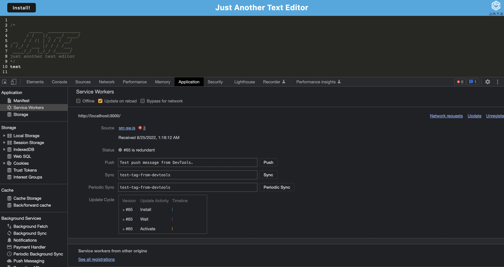
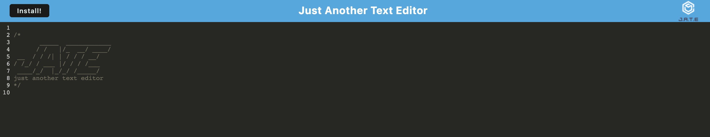

# what-I-learned-in-boating-school-is... // note taker

## Table of Contents 
 1. [Screenshots](#screenshots)
 2. [Description](#description)
 3. [Deployed Link](#deployed-link)
 3. [User Story](#user-story)
 4. [Installation](#installation)
 5. [Utilized With](#utilized-with)
 6. [license](#license)

 
 ## screenshots
 - 
 - 

 ## deployed Link
 [heroku link](https://boating-school.herokuapp.com/)
 
 ## description 
 This application is a text-based editor, called JATE. It runs either locally, in the browser, or in the deployed link via heroku. This application allows for small/snippets of notes. This application can be used for a myraid of things, from quick reminders about grocery shopping, to upcoming meetings, or code ideas that you just *have to jot down, right this second.*

 ## user story
* AS A developer
* I WANT to create notes or code snippets with or without an internet connection
* SO THAT I can reliably retrieve them for later use

## installation
This application can be ran in several ways:

1.) clone the repo, and run `npm i`, followed by `npm start`, to run the application locally. (It lives at localhost:3000).

2.) Simply click the deployed link (above), and utilize the application from there!
 

## utilized-with
* Node
* Express
* PWA
* Heroku

## license

None.
